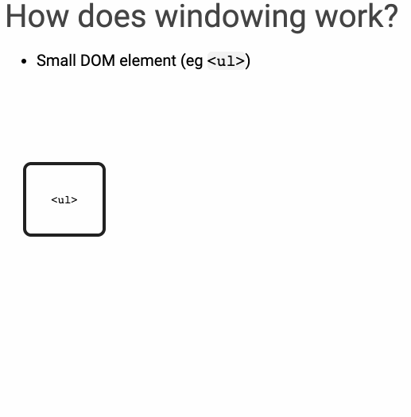

import { FullScreenCode, Invert, Split, SplitRight, Horizontal } from "mdx-deck/layouts";
import { Image } from "mdx-deck"
import { CodeSurfer } from "mdx-deck-code-surfer"
import nightOwl from "prism-react-renderer/themes/nightOwl"
import Box from "../../components/Box";

export default Invert 

# Rendering Large Data

---

## Virtualize Long Lists 

* Just because we have 10,000+ records does not mean we need to display them all
* Virtualizing long lists to only render what is visible can help with performance 
* Implementing this yourself can be tricky, but exellent solutions exist.

- [react-virtualized](https://github.com/bvaughn/react-virtualized)
- [react-window](https://github.com/bvaughn/react-window)

---

## General Concept 

- Create and maintain a "window" 
- The window moves over your list / data 
- Only create / render items that your user can see

---
export default Horizontal

[@bvaughn - Creating more efficient React views with windowing](https://bvaughn.github.io/forward-js-2017/#/0/0)

<Box>

 

</Box>

---

## Resources / Articles

- [React-Virtualized: Why, When and How you should use it](https://blog.theodo.fr/2018/09/use-react-virtualized/)
- [Rendering large lists with React Virtualized](https://blog.logrocket.com/rendering-large-lists-with-react-virtualized-82741907a6b3)
- [Rendering Lists Using React Virtualized](https://css-tricks.com/rendering-lists-using-react-virtualized/)
- [What I learned from building my own virtualized list library for React](https://dev.to/nishanbajracharya/what-i-learned-from-building-my-own-virtualized-list-library-for-react-45ik)
- [Rendering large lists with react-window](https://addyosmani.com/blog/react-window/)

